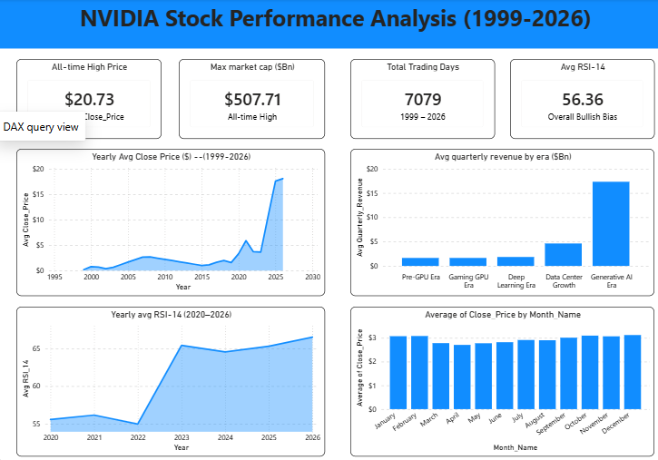

# NVIDIA Stock Performance Analysis (1999–2026)

An interactive Power BI dashboard analyzing 26 years of NVIDIA Corporation (NASDAQ: NVDA) stock performance — from its 1999 IPO to the Generative AI boom.

## Key Insights
- All-time high close price: **$20.73**
- Peak market cap: **$507.71B**
- 7,079 trading days analyzed
- Generative AI Era (2023–2026) generated 9x more revenue than the Data Center era

## Tools Used
Power BI · DAX · Power Query

## Dataset
Source: [Kaggle](https://www.kaggle.com) — NVIDIA historical stock data (1999–2026)

## Author
**Muhammad Humair** — Data Analyst
[LinkedIn](https://www.linkedin.com/in/humair12/) · [Portfolio](https://humairdata7.github.io/)
